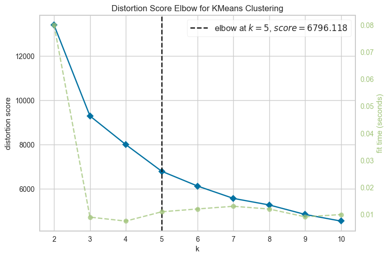
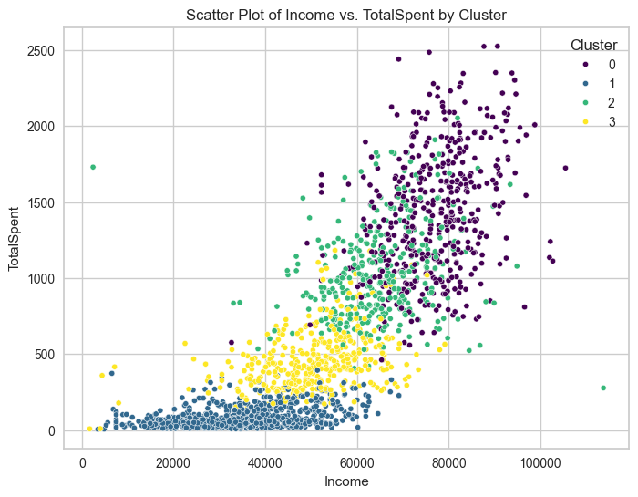
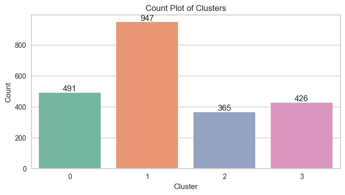
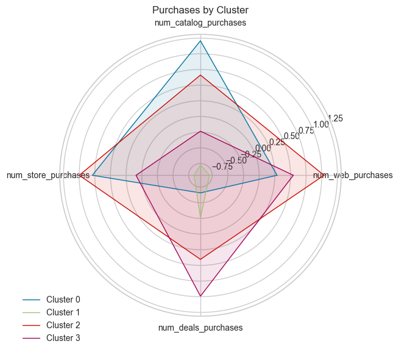

## Customer Segmentation and Profiling for Retail Store

### Abstract

The goal of this project is to better analyse and segment a retail store's client base in order to improve customer service and marketing tactics. To accomplish these objectives, I worked on a variety of modelling and data analysis activities for this project.

Understanding and defining the business challenge was the first step. I had to determine the significance of client segmentation for the retail establishment and the ways in which it may improve the targeting of marketing initiatives. I was able to comprehend the data, its structure, and the significance of each characteristic by thoroughly examining the dataset.

To ensure data quality, I cleaned the dataset by removing null and duplicated rows. After that, I dropped unnecessary features that did not contribute to the analysis. Data preprocessing was then conducted to prepare the data for Exploratory Data Analysis (EDA). During the EDA, I explored various aspects of the data, performed feature engineering, and analyzed outliers to identify patterns and insights. 

After completing the EDA, I used K-Means to identify the most pertinent characteristics for the clustering model. I implemented feature encoding and scaling to enhance the model's performance. To further improve the clustering procedure and minimise dimensionality, Principal Component Analysis (PCA) was employed.

The K-Means model was built with five clusters using the preprocessed data, and I examined the traits and behaviours of each cluster. Lastly, I wrapped up the profiles of the clusters, offering the retail outlet practical advice on how to better customise their marketing plans and customer support initiatives.

I thoroughly loved working on this project and was able to show off my proficiency in doing in-depth data analysis and using machine learning approaches to address business challenges. I gained new skills and a deeper grasp of client segmentation and profiling from this amazing learning experience.

### Technologies

- Python (Pandas, Numpy, Matplotlib, Seaborn, Scikit-Learn)
- Jupyter Notebook
- Preprocessing (Feature Encoding, Feature Scaling, PCA)
- Machine Learning Clustering (K-Means)
- Git and GitHub

### 1. EDA 

#### 1.1 Dataset

We have a total of 28 features, excluding the ID. Among them, there are 2 categorical features and 26 numerical features.

**People:** 

- ID: Customer's unique identifier
- Year_Birth: Customer's birth year
- Education: Customer's education level
- Marital_Status: Customer's marital status
- Income: Customer's yearly household income
- Kidhome: Number of children in customer's household
- Teenhome: Number of teenagers in customer's household
- Dt_Customer: Date of customer's enrollment with the company
- Recency: Number of days since customer's last purchase
- Complain: 1 if the customer complained in the last 2 years, 0 otherwise

**Products:** 
- MntWines: Amount spent on wine in last 2 years
- MntFruits: Amount spent on fruits in last 2 years
- MntMeatProducts: Amount spent on meat in last 2 years
- MntFishProducts: Amount spent on fish in last 2 years
- MntSweetProducts: Amount spent on sweets in last 2 years
- MntGoldProds: Amount spent on gold in last 2 years

These product features represent the amounts spent on each type of product.

**Marketing Promotion:** 

- NumDealsPurchases: Number of purchases made with a discount
- AcceptedCmp1: 1 if customer accepted the offer in the 1st campaign, 0 otherwise
- AcceptedCmp2: 1 if customer accepted the offer in the 2nd campaign, 0 otherwise
- AcceptedCmp3: 1 if customer accepted the offer in the 3rd campaign, 0 otherwise
- AcceptedCmp4: 1 if customer accepted the offer in the 4th campaign, 0 otherwise
- AcceptedCmp5: 1 if customer accepted the offer in the 5th campaign, 0 otherwise
- Response: 1 if customer accepted the offer in the last campaign, 0 otherwise

**Place:** 

- NumWebPurchases: Number of purchases made through the company’s website
- NumCatalogPurchases: Number of purchases made using a catalogue
- NumStorePurchases: Number of purchases made directly in stores
- NumWebVisitsMonth: Number of visits to company’s website in the last month

#### 1.2 Conclusion

1. The product spending features are skewed to the right, meaning that while most customers spend less, some do so considerably more. Among all product categories, wine has the greatest average spending.

2. Features related to purchase frequency also show a little right skew. In general, consumers make more purchases in-person or online; outliers signify customers who make transactions frequently.

3. The efficacy of the store's existing initiatives is minimal, as only a tiny percentage of consumers participate in any given campaign. This emphasises how important clustering research is for more precise campaign targeting across client segments.

4. While some clients have no childs living at home, the majority has at least one. Few people have two kids. The majority of clients also have partners and are recent grads.

5. There is a substantial negative correlation between income and having children at home, indicating that consumers with higher incomes typically have fewer or no children, and vice versa.

6. Spending on pricey goods like wine and meat is positively correlated with income. Given that higher-income consumers typically buy these things more frequently, this association seems sense.

7. Income and catalogue and in-store purchases have a high positive correlation, whereas monthly online visits and income have a negative correlation. This emphasises how crucial it is to improve higher-income customers' catalogue and in-store shopping experiences.

8. Customers with higher incomes are more inclined to participate in marketing initiatives.

9. There is a somewhat good correlation between having childs at home and looking for deals while making purchases.

10. The amount spent on different product kinds is strongly inversely correlated with monthly site visits, suggesting that these things are frequently bought through alternative channels like catalogues and storefronts. Additionally, there is a somewhat positive link with bargain purchases, indicating that regular users of the website have a tendency to buy things at a discount.

11. Higher-income consumers were successfully targeted by Campaigns 1 and 5, especially when it came to wine and meat purchases. Customers who made larger purchases showed a significantly greater proportion of marketing acceptance.

### 2. Clustering

The steps involved in the Clustering are:

- Elbow Method to determine the optimum number of clusters
- Employ the KMeans 
- Examining the clusters

#### 2.1 Elbow

The Elbow method indicates that 4 is to optimal number of clusters.

#### 2.2 Visualization

#### 2.3 Conclusion

##### Cluster 0:

- Features the highest income and spending.
- Typically consists of families with no children and between 1 to 2 members.
- Mostly on graduated education levels.
- Purchases a lot on catalog, store, and a little on web channels.
- Shows significant expenditure on all types of products.
- Predominantly responds to campaign 1 and 5.

##### Cluster 1:

- Characterized by low income and spending.
- Typically consists of families with at least one child.
- Mostly on graduated to postgraduate education levels.
- Purchases primarily through deals and web purchases..
- Purchases fewer products but shows a slight preference for gold items
- Shows a low rate of campaign acceptance, with campaign 3 and 4 being the most accepted.

##### Cluster 2:

- Exhibits high to average income and spending.
- Contains the largest families, with 3 to 4 members.
- Mostly on graduated to postgraduate education levels.
- Includes the oldest demographic.
- Favors purchases from catalogs.
- Makes numerous purchases, showing no strong preference for any particular purchase method. However, store and web purchases are the most common.
- Shows a average acceptance rate for campaigns 3 and 4.

##### Cluster 3:

- Noted for the lowest income and spending.
- Comprises families of 2 or 3 members.
- Includes the youngest demographic.
- Mostly on basic education levels.
- Frequently purchases through deals.
- Shows a high acceptance rate for campaign 3.