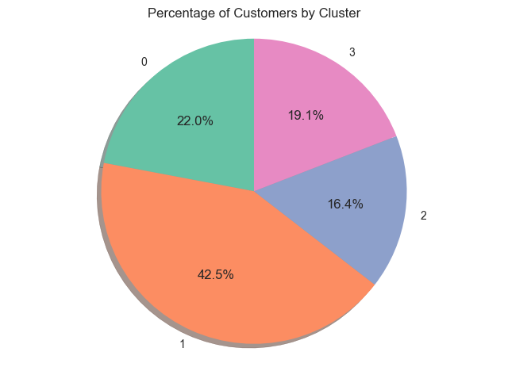
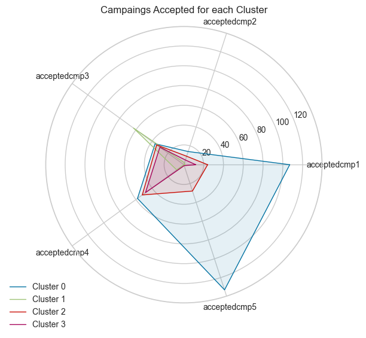

# Segmentação e Perfilamento de Clientes para Loja de Varejo

## Resumo

Este projeto teve como objetivo melhorar o atendimento ao cliente e as estratégias de marketing de uma loja de varejo por meio da análise e segmentação da base de clientes. Para isso, apliquei diversas técnicas de análise de dados e modelagem, começando pela compreensão do desafio de negócios e de como a segmentação poderia aprimorar os esforços de marketing direcionado. Isso envolveu a exploração do conjunto de dados, sua estrutura e a importância de cada variável.

Para garantir a qualidade dos dados, limpei o conjunto de dados removendo valores nulos e registros duplicados. Também eliminei variáveis irrelevantes e realizei etapas de pré-processamento para preparar os dados para a Análise Exploratória (EDA). Durante a EDA, trabalhei na engenharia de variáveis, analisei outliers e identifiquei padrões para extrair insights úteis.

Para a segmentação de clientes, utilizei o algoritmo de clustering K-Means, aplicando codificação de variáveis e escalonamento para melhorar o desempenho do modelo. Além disso, a Análise de Componentes Principais (PCA) ajudou a reduzir a dimensionalidade e tornar o agrupamento mais eficiente. Desenvolvi um modelo com cinco grupos distintos de clientes e analisei suas características e comportamentos em detalhes. Isso permitiu a criação de perfis de clientes e a formulação de recomendações para marketing personalizado e atendimento ao cliente.

Para aproveitar ao máximo os insights obtidos na segmentação, propus um programa de fidelidade voltado para os clientes mais valiosos, incluindo descontos, produtos exclusivos e promoções personalizadas. As projeções financeiras sugeriram um aumento na receita de $125.691,45, representando um crescimento de 9%. Este projeto não apenas fortaleceu minhas habilidades em análise de dados e aprendizado de máquina, mas também me proporcionou experiência prática em segmentação de clientes e tomada de decisões baseada em dados.

## Tecnologias

Python (Pandas, Numpy, Matplotlib, Seaborn, Scikit-Learn)
Pré-processamento (Codificação de Variáveis, Escalonamento, PCA)
Clusterização com ML (K-Means, Método do Cotovelo)

## 1. Análise Exploratória de Dados (EDA)

### 1.1 Conjunto de Dados

Temos um total de 28 variáveis, excluindo o ID. Entre elas, há 2 variáveis categóricas e 26 variáveis numéricas.

**Pessoas:**

ID: Identificador único do cliente
Year_Birth: Ano de nascimento do cliente
Education: Nível de escolaridade do cliente
Marital_Status: Estado civil do cliente
Income: Renda anual do cliente
Kidhome: Número de crianças na residência do cliente
Teenhome: Número de adolescentes na residência do cliente
Dt_Customer: Data de inscrição do cliente na empresa
Recency: Número de dias desde a última compra do cliente
Complain: 1 se o cliente fez uma reclamação nos últimos 2 anos, 0 caso contrário

**Produtos:**

MntWines: Quantia gasta em vinhos nos últimos 2 anos
MntFruits: Quantia gasta em frutas nos últimos 2 anos
MntMeatProducts: Quantia gasta em carnes nos últimos 2 anos
MntFishProducts: Quantia gasta em peixes nos últimos 2 anos
MntSweetProducts: Quantia gasta em doces nos últimos 2 anos
MntGoldProds: Quantia gasta em produtos de ouro nos últimos 2 anos

**Promoção de Marketing:**

NumDealsPurchases: Número de compras realizadas com desconto
AcceptedCmp1 a AcceptedCmp5: 1 se o cliente aceitou a oferta da respectiva campanha, 0 caso contrário
Response: 1 se o cliente aceitou a oferta na última campanha, 0 caso contrário

**Local de Compra:**

NumWebPurchases: Número de compras feitas pelo site da empresa
NumCatalogPurchases: Número de compras feitas via catálogo
NumStorePurchases: Número de compras feitas diretamente nas lojas
NumWebVisitsMonth: Número de visitas ao site da empresa no último mês

### 1.2 Métrica RFM

A métrica RFM (Recency, Frequency, Monetary) é uma técnica de segmentação usada para categorizar clientes com base em seu comportamento de compra recente.

- Recency (Recência): Há quanto tempo o cliente fez a última compra
- Frequency (Frequência): Quantidade de compras realizadas pelo cliente
- Monetary (Monetário): Valor total gasto pelo cliente

 

Esses fatores permitem segmentar os clientes e direcionar estratégias de marketing para melhorar retenção e maximizar receita.

### 1.3 EDA - R(FM) Map

### Conclusão

1. As variáveis relacionadas aos gastos com produtos apresentam uma distribuição assimétrica à direita, o que significa que, enquanto a maioria dos clientes gasta pouco, alguns gastam consideravelmente mais. Entre todas as categorias de produtos, o vinho possui a maior média de gastos.

2. As variáveis relacionadas à frequência de compras também apresentam uma leve assimetria à direita. De modo geral, os consumidores realizam mais compras presencialmente ou online, e os outliers representam clientes que fazem transações com alta frequência.

3. A eficácia das campanhas de marketing atuais da loja é mínima, pois apenas uma pequena porcentagem dos clientes participa de qualquer campanha. Isso destaca a importância da segmentação para direcionar campanhas de forma mais precisa entre os diferentes perfis de clientes.

4. Enquanto alguns clientes não têm filhos em casa, a maioria tem pelo menos um. Poucas pessoas possuem dois filhos. A maioria dos clientes também tem um parceiro e é formada por recém-graduados.

5. Há uma correlação negativa significativa entre renda e a presença de filhos no lar, indicando que consumidores com rendas mais altas tendem a ter menos ou nenhum filho, e vice-versa.

6. Os gastos com produtos mais caros, como vinho e carne, estão positivamente correlacionados com a renda, uma vez que consumidores de renda mais alta compram esses itens com maior frequência.

7. A renda tem uma forte correlação positiva com compras via catálogo e em lojas físicas, enquanto apresenta uma correlação negativa com visitas mensais ao site. Isso destaca a necessidade de aprimorar a experiência de compra via catálogo e em lojas físicas para clientes de alta renda.

8. Clientes com maior renda demonstram maior inclinação para participar de campanhas de marketing.

9. Há uma correlação moderada entre ter filhos em casa e buscar descontos ao realizar compras.

10. O valor gasto em diferentes tipos de produtos tem uma correlação inversa significativa com as visitas mensais ao site, sugerindo que esses itens são frequentemente adquiridos por outros canais, como catálogos e lojas físicas. Além disso, há uma correlação moderada com compras promocionais, indicando que os usuários frequentes do site tendem a buscar descontos.

11. Os consumidores de renda mais alta foram impactados com sucesso pelas Campanhas 1 e 5, especialmente em relação às compras de vinho e carne. Clientes que realizaram compras em maior volume apresentaram uma taxa de aceitação de marketing significativamente maior.

## Clusterização

As etapas envolvidas na clusterização incluem:

- Método do Cotovelo para determinar o número ideal de clusters
- Aplicação do K-Means
- Análise dos clusters

### Elbow

O método do cotovelo indicou que 5 é o número ideal de clusters.

### Visualização

#### 2.2.1 Clusterização em 3D usando PCA

#### 2.2.2 Clusterização em 2D comparando Renda e Total Gasto

#### 2.2.3 Distribuição dos Clusters

#### 2.2.4 Visualização das diferenças nos tipos de compra entre os clusters

#### 2.2.5 Visualização das diferenças nos tipos de produtos adquiridos entre os clusters

#### 2.2.6 Visualização das diferenças na participação em campanhas entre os clusters

#### 2.2.7 Visualização da receita gerada por cada cluster

### 2.3 Conclusão

#### Cluster 0 - "Prosperous Shoppers"

- Apresenta a maior renda e gasto.
- Possui as famílias menores, ou seja, não tem filhos.
- Em sua maioria, são graduados, com alguns que também completaram pós-graduação.
- Realizam compras com frequência, com forte preferência por compras em lojas físicas e por catálogo.
- Mostra um gasto significativo em todos os tipos de produtos.
- Predominantemente responde às campanhas 1 e 5.
- Uma mistura de pessoas idosas e de meia-idade, com algumas pessoas jovens.
- Comumente não utiliza o aplicativo web.
- Recência: Alta.
- Frequência: Alta.

#### Cluster 1 - "Low Budget"

- Caracterizado pela menor renda e menores gastos.
- Tipicamente composto por famílias pequenas.
- Em sua maioria, são graduados, com alguns que também completaram pós-graduação.
- Raramente fazem compras, demonstrando alta preferência por promoções.
- Compram menos produtos, mas mostram uma leve preferência por alimentos e produtos de ouro.
- Mostra uma baixa taxa de aceitação de campanhas, sendo a campanha 3 a mais aceita.
- Comumente pessoas de meia-idade, com a maioria sendo jovens.
- Utilizam frequentemente o aplicativo web.
- Recência: Alta.
- Frequência: Baixa.

#### Cluster 2 - "Affluent Families"

- Apresenta a segunda maior renda e gasto.
- Tipicamente composto por casais com um filho.
- Em sua maioria, são graduados, com muitos que também completaram pós-graduação.
- Realizam o maior número de compras, sem forte preferência por nenhum método específico de compra.
- Mostra um gasto significativo com vinhos e itens de ouro.
- Mostra uma baixa taxa de aceitação de campanhas, sendo as campanhas 3 e 4 as mais aceitas.
- Comumente pessoas idosas.
- Comumente não utilizam o aplicativo web.
- Recência: Baixa.
- Frequência: Alta.

#### Cluster 3 - "Web-Discount Seekers"

- Caracterizado pela renda e gastos médios.
- Composto por famílias maiores.
- Em sua maioria, possuem níveis educacionais de graduação a pós-graduação.
- Frequentemente fazem compras, favorecendo ofertas e compras online.
- Apresenta um gasto considerável, com preferência por vinhos e produtos de ouro.
- Mostra uma baixa taxa de aceitação de campanhas, sendo as campanhas 3 e 4 as mais aceitas.
- Uma mistura de pessoas idosas e de meia-idade.
- Utilizam frequentemente o aplicativo web.
- Recência: Baixíssima.
- Frequência: Alta.

## 3. Programa de Fidelidade

Após analisar os clusters, podemos inferir que os clientes mais valiosos para um programa de fidelidade são os *Prosperous Shoppers*, pois eles possuem:

- alta renda;
- compram muitos produtos;
- representam 49% da receita total;
- respondem bem às campanhas.

### 3.1 Premissas do Programa de Fidelidade

- Assumi que o estabelecimento comercial pode aumentar a renda de sua clientela próspera em 15% por meio de esforços de marketing focados, mercadorias personalizadas e ofertas exclusivas.
- Como os clientes *Prosperous Shoppers* e *Affluent Families* são comparáveis, estimei uma taxa de conversão de 30% para os clientes prósperos.
- Em seguida, assumi as seguintes taxas de conversão para os *Prosperous Shoppers*, dado que as outras categorias são mais dissimilares: *Web-Discount Seekers* = 10% e *Low Budget* = 5%.

### 3.2 Results

- Receita total antes do programa de fidelidade para os *Prosperous Shoppers*: $1.349.751,00.
- Receita total após o programa de fidelidade para os *Prosperous Shoppers*: $1.475.442,45.
- A receita aumentou em 9,00%.
- A receita aumentou em $125.691,45.
